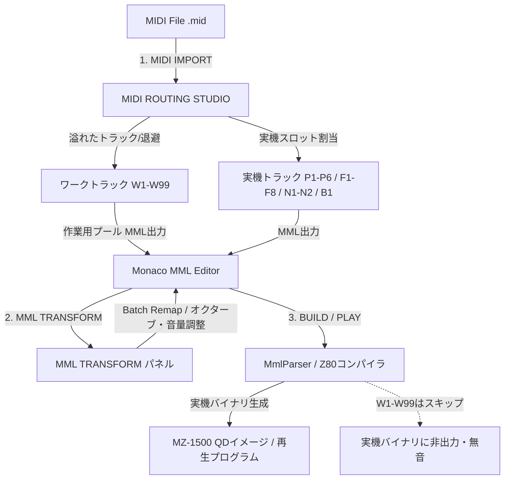

# ワークトラック & MML TRANSFORM / MIDI IMPORT 実装引継ぎ仕様書 (Handoff Guide)

本ドキュメントは、モック設計および文法・パーサー基盤の先行対応が完了した以下の新機能について、**後続のAIエージェントが本実装をスムーズに進められるよう、仕様・アーキテクチャ・残タスクを整理した引継ぎ資料**です。

---

## 1. 概要と設計思想

MZ-1500 Sound IDE は、限られた実機発音数（PSG 6ch + NOISE 2ch + BEEP 1ch、および拡張FM 8ch）の中で高度な楽曲制作を行うための環境です。
外部の MIDI ファイル（SMF）や既存の MML を取り込んで再配置・再編集するワークフローを確立するため、以下のシステムを設計・導入しました。

---

## 2. 確定仕様一覧

### 2.1 ワークトラックシステム (`W1`〜`W99`)
- **位置づけ**: 実機バイナリ（Z80演奏データ）には出力されない**「作業用・一時退避用トラック」**。
- **文法**: **PSG準拠**（音階 `cde`, 音長 `4`, 音量 `v0-v15`, エンベロープ `@v`, `@p` 等が記述可能）。
- **コンパイル動作**:
  - `src/core/mml/parser/MmlParser.ts` にて `W\d+` を検出した際、エラーにせず安全にスキップ（実機バイナリのデータサイズ・演奏ルーチンに一切影響を与えない）。
  - 後続のトラック指定なし行が前の実機トラックと混ざらないようコンパイルコンテキストをクリア。
- **エディタ対応**:
  - `src/utils/mmlCaretParser.ts`: キャレット位置判定で PSG トラックとして認識。
  - `src/utils/mmlLanguage.ts`: シンタックスハイライト（青紫・PSG色）およびオートコンプリート対応。
- **プレビュー動作**:
  - 実機演奏および Web Audio プレビューの対象外（無音）。
- **トラックモニター**:
  - モニターチャンネルとしては非表示。
  - パネル最下部に仕様とワークフローを解説する Bento Card を常設。

### 2.2 MML TRANSFORM パネル (`src/view/MmlTransformPanel.tsx`)
- **配置**: 右ペイン第5タブ（タブ名: `TRANSFORM`、アイコン: `Shuffle`）。
- **対象トラック選択 (`TARGET TRACKS`)**:
  - ボタン列挙・複数選択式（実機 PSG `P1-P6`, NOISE `N1-N2`, BEEP `B1`, 拡張FM `F1-F8`, ワーク `W1-W4`）。
  - クイック選択バー: `ALL`, `PSG (6ch)`, `FM (8ch)`, `WORK (4ch)`, `CLEAR`。
  - FM音源スイッチ（OFF時）と連動し、FMチャンネルを非活性化＆有効化リンクを表示。
- **変換ツール群**:
  1. **CHANNEL / TRACK REASSIGN (リマップ)**:
     - 単一リマップ: `From -> To` ドロップダウン。
     - **BATCH REMAP (一括リマップ)**: 複数トラックの一括置換。
       - `P# ➔ F# (PSGをFMへ)`
       - `F# ➔ P# (FMをPSGへ)`
       - `W# ➔ P# (作業トラックを実機へ)`
       - `W# ➔ F# (作業トラックをFMへ)`
  2. **OCTAVE SHIFT (オクターブ一括シフト)**: `o+2`, `o+1`, `o-1`, `o-2`。
  3. **VOLUME SCALE (音量スケーリング)** (UI 追加実装済み・2026-09-07):
     - 加減算 (`+2`, `+1`, `-1`, `-2`) と割合 (`50%`, `75%`, `100%`, `125%`, `150%`) を選択して `音量のみ反映` ボタンで適用。
     - 適用式: `round(v × percent / 100) + add`。PSG `v` (0-15) と FM `@v` (0-127、FM トラック `F1`-`F8` の行のみ) にクランプ。
     - ~~QUANTIZE / NOTE ALIGN~~ および ~~TEMPO SCALE~~ は 2026-09-07 ユーザー確定により**仕様から削除 (不採用)**。

### 2.3 MIDI ROUTING STUDIO (`src/view/MidiRouterModal.tsx`)
- **起動**: ヘッダーの `[MIDI IMPORT]` ボタンからモーダル起動。
- **3カラム・インテリジェントルーティング設計**:
  - **Column 1**: MIDI ファイル内トラック検出リスト（トラック名、ノート数、音域、推奨割り当て）。
  - **Column 2**: 実機音源スロット別アサインマトリクス。
    1. DCSG PSG (`P1`〜`P6`)
    2. DCSG NOISE (`N1`〜`N2`) & BEEP (`B1`)
    3. 拡張FM ACZ-8BS1MZ (`F1`〜`F8`) ※OFF時はロック
    4. **Work Tracks (`W1`〜`W4`) [作業用プール]** ※アンバー表示
  - **Column 3**: 割り当てサマリーカード & 出力オプション設定。
    - ワークトラック警告表示（「4chのMIDIトラックが実機枠を超過したため、W1〜W4に割り当てられました」等）。
    - FM音源が無効の場合は「+ FM音源(YM2151)を有効化する」ボタンで即座に8ch分拡張可能。
- **MML出力**:
  - 実機スロットへ割り当てられたトラックは `P1 ...`, `F1 ...` として出力。
  - 超過分・プール分は `W1 ...`, `W2 ...` としてエディタ先頭または末尾へ出力。

---

## 3. 現状のコードベース構成

| ファイルパス | 役割・状態 | 後続AIの作業 |
| :--- | :--- | :--- |
| `src/core/transform/mmlTransformEngine.ts` / `mmlTrackScope.ts` | **MML TRANSFORM 実テキスト変換エンジン (Step 1 完了・2026-09-07)**。リマップ/オクターブシフト/半音移調/音量スケーリングを実装。テスト 30 件 (`src/core/transform/__tests__/mmlTransformEngine.test.ts`) | 現状のままで可。QUANTIZE / TEMPO SCALE は不採用 (2026-09-07 ユーザー確定) |
| `src/view/MmlTransformPanel.tsx` | MML TRANSFORM パネル (**本実装済み・Monaco Editor へ `MmlTransformRequest` 経由で反映**)。VOLUME SCALE UI 追加済み (2026-09-07) | QUANTIZE / TEMPO SCALE は不採用 (ユーザー確定) |
| `src/core/midi/midiToMmlConverter.ts` / `demoMidi.ts` | **MIDI → MML 変換エンジン (Step 2 完了・2026-09-07)**。`@tonejs/midi` で解析し、ボイス分解・音長量子化・自動ルーティング・MML 生成を実装。テスト 19 件 (`src/core/midi/__tests__/midiToMmlConverter.test.ts`) | 現状のままで可。テスト再生 (Web Audio) 実装時にプレビュー連携を追加 |
| `src/view/MidiRouterModal.tsx` | MIDI ROUTING STUDIO (**本実装済み**・実 `.mid` 解析 → 自動ルーティング → `APPLY TO MML` でエディタ先頭へ挿入) | Step 2 完了。Column 2/3 の個別アサイン UI とエンジン接続の微調整は必要に応じて |
| `src/core/mml/parser/MmlParser.ts` | MMLコンパイラ本体（`W\d+` スキップ実装済み） | 現状のままで実機バイナリ生成から安全に除外される（完了） |
| `src/core/mml/__tests__/MmlCompiler.test.ts` | コンパイラ単体テスト（Wトラック除外テスト追加済み） | 必要に応じて追加テストを作成 |
| `src/utils/mmlCaretParser.ts` | エディタキャレット位置追跡（`W1-W99` 登録済み） | 完了 |
| `src/utils/mmlLanguage.ts` | Monaco エディタ構文定義（`W1-W99` 登録済み） | 完了 |
| `src/view/TrackMonitor.tsx` | トラックモニター（Wトラック解説 Bento Card 搭載済み） | 完了 |
| `src/app/App.tsx` | モーダル・パネル統合、`enableYM2151` 連動済み | 各機能のステートバインディング |
| `docs/specification/ui.md` | §3.3, §3.9, §3.10, §3.11 詳細仕様書 | 参照用（最新化済み） |
| `docs/specification/mml_reference.md` | §2 トラック構成表（`W1-W99` 掲載済み） | 参照用（最新化済み） |

---

## 4. 本実装（Phase 2）に向けた実装タスク & 手順

後続のAIエージェントは、以下の順序で実装を進めることを推奨します。

### Step 1: MML TRANSFORM の実テキスト変換エンジンの実装
1. **変換コア関数 (`src/core/transform/mmlTransformEngine.ts` 等) の新設**:
   - 入力: 変換前 MML 文字列、対象トラック配列（`string[]`）、変換種別、パラメータ
   - 出力: 変換後 MML 文字列
2. **変換ロジック**:
   - **トラックリマップ**:
     - 行頭または空白区切りの `P1`, `W1` などの識別子を置換（正規表現 `/(^|\n)\s*([A-Z]\d+)/g` や MML トークナイザーを活用）。
   - **オクターブシフト**:
     - 対象トラック行内の `o[1-8]` を `oN+shift`（範囲 1〜8 にクランプ）へ置換、または `<` / `>` の反転・補正。
   - **音量変更**:
     - 対象トラック行内の `v\d+` を計算して置換（PSG: 0〜15、FM: 0〜127 にクランプ）。
3. **Monaco Editor への適用**:
   - `App.tsx` または `MmlTransformPanel` からエディタの `executeEdits` またはテキスト更新ハンドラを呼び出し、Undo/Redo 履歴を保持したまま適用する。

### Step 2: MIDI ファイルの実解析と MML 生成
1. **MIDI パーサーの導入**:
   - `@tonejs/midi` などを利用してブラウザ上で `.mid` ファイルを解析。
   - トラック名、チャンネル番号、ノートイベント（MIDI Note, Velocity, Time, Duration）を取得。
2. **ルーティング画面へのデータバインディング**:
   - `MidiRouterModal.tsx` のドラッグ＆ドロップエリアで実ファイルを受領し、解析結果を Column 1（MIDIトラックリスト）に展開。
3. **MIDI ➔ MML コンバータ (`src/core/midi/midiToMmlConverter.ts` 等)**:
   - 各ノートイベントを MML 音階（`cde`）および音長（`4`, `8`, `16`、付点、タイ `&`）に量子化。
   - スロット割り当て（`P1-P6`, `F1-F8`, `W1-W99`）に基づいてトラックプレフィックスを付与。
   - `handleApply` 実行時にエディタへ MML を挿入。

### Step 3: Web Audio プレビューのチャンネル制御 (検証完了・2026-09-07)
- `W1`〜`W99` トラックは Web Audio プレビューの対象外（再生しない）。
- `P1-P6`（PSG）、`F1-F8`（FM）、`N1-N2`（ノイズ）、`B1`（BEEP）のみがオーディオノードへルーティングされることを担保。
- **検証結果 (2026-09-07)**: プレビュー再生 (Z80 DRIVER / SOURCE INTERPRETER) はコンパイル結果ベースのため、`MmlParser` の W 行スキップにより W トラックのデータ自体が実機バイナリ / `MmlMap` に存在しない (= 無音)。下記観点を `MmlCompiler.test.ts` で担保済み:
  - W の音符が実機トラック (P1) のデータへ混線しない (MmlMap の note イベント数で検証)
  - `MmlMap` に W トラックが含まれない (演奏ハイライト・シーケンサの対象外)
  - W 行の後の無宣言行はコンテキストクリアによりエラーになる (実機トラックへの混線防止)

---

## 5. 設計上の注意点（Gotchas & Constraints）

1. **実機バイナリ生成（Z80プログラム）への影響防止**:
   - `W1`〜`W99` は実機プログラムでは解釈できません。そのため `MmlParser.ts` で完全に破棄（スキップ）される挙動を厳守してください。
   - 実機演奏させたいフレーズは、ユーザーが MML TRANSFORM または手動編集で実機トラック（`P1-P6`, `F1-F8` 等）に移動させる運用です。
2. **TypeScript strict モード**:
   - 本リポジトリは `noUnusedLocals: true` となっています。未使用のインポートや変数はビルドエラーになりますので注意してください。
3. **ビルド検証コマンド**:
   - 単体テスト: `npm test`
   - 型チェック・プロダクションビルド: `npm run build`
